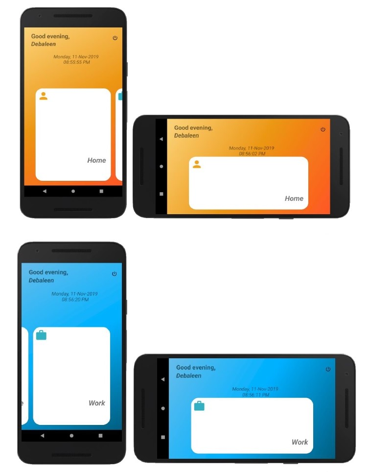
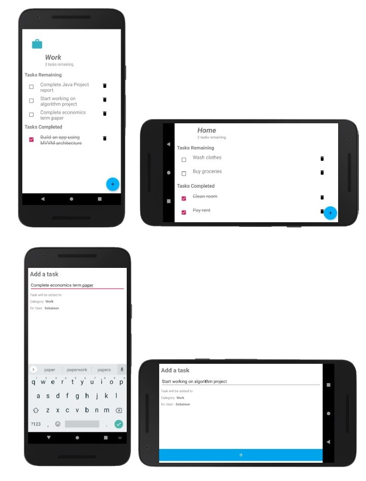
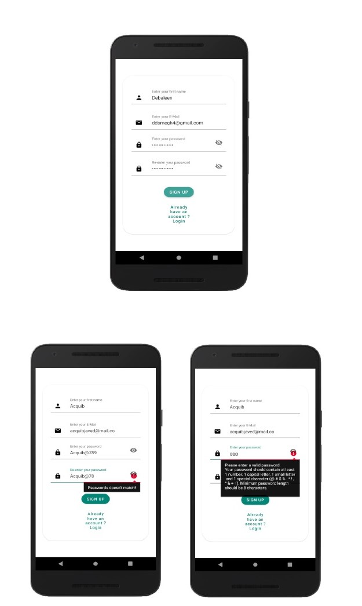

<p align="center">
  
</p>

# Task Manager

[](LICENSE)


**Task Manager** is a simple  to-do Android application 📱 which uses MVVM pattern and Android Architecture Components. Dedicated to all Android Developers with ❤️. 

<table style="width:100%">
  <tr>
    <th>Home Screens</th>
    <th>Tasks Screen</th>
    <th>Login & Registration Screen</th>
  </tr>
  <tr>
    <td></td>
    <td></td>
    <td></td>
  </tr>
</table>

## About
- It is a simple to-do app where users can maintain their tasks.
- Tasks can be categorized into 2 different categories viz. Home & Work.
- Users can sign up in the app using their email.
- The app stores data locally.

## Built With 🛠
- [Java](https://docs.oracle.com/javase/8/docs/technotes/guides/language/index.html) - A general-purpose, concurrent, strongly typed, class-based object-oriented language.
- [Android Architecture Components](https://developer.android.com/topic/libraries/architecture) - Collection of libraries that help you design robust, testable, and maintainable apps.
  - [LiveData](https://developer.android.com/topic/libraries/architecture/livedata) - Data objects that notify views when the underlying database changes.
  - [ViewModel](https://developer.android.com/topic/libraries/architecture/viewmodel) - Stores UI-related data that isn't destroyed on UI changes. 
  - [Room Persistence Library](https://developer.android.com/topic/libraries/architecture/room) - The Room persistence library provides an abstraction layer over SQLite to allow for more robust database access while harnessing the full power of SQLite.

    

## Credits
Thanks to
- [Coding in Flow](https://codinginflow.com/) - for his awesome tutorials on Android Development.


## License
```
MIT License

Copyright (c) 2020 Debaleen Das Spandan

Permission is hereby granted, free of charge, to any person obtaining a copy
of this software and associated documentation files (the "Software"), to deal
in the Software without restriction, including without limitation the rights
to use, copy, modify, merge, publish, distribute, sublicense, and/or sell
copies of the Software, and to permit persons to whom the Software is
furnished to do so, subject to the following conditions:

The above copyright notice and this permission notice shall be included in all
copies or substantial portions of the Software.

THE SOFTWARE IS PROVIDED "AS IS", WITHOUT WARRANTY OF ANY KIND, EXPRESS OR
IMPLIED, INCLUDING BUT NOT LIMITED TO THE WARRANTIES OF MERCHANTABILITY,
FITNESS FOR A PARTICULAR PURPOSE AND NONINFRINGEMENT. IN NO EVENT SHALL THE
AUTHORS OR COPYRIGHT HOLDERS BE LIABLE FOR ANY CLAIM, DAMAGES OR OTHER
LIABILITY, WHETHER IN AN ACTION OF CONTRACT, TORT OR OTHERWISE, ARISING FROM,
OUT OF OR IN CONNECTION WITH THE SOFTWARE OR THE USE OR OTHER DEALINGS IN THE
SOFTWARE.
```